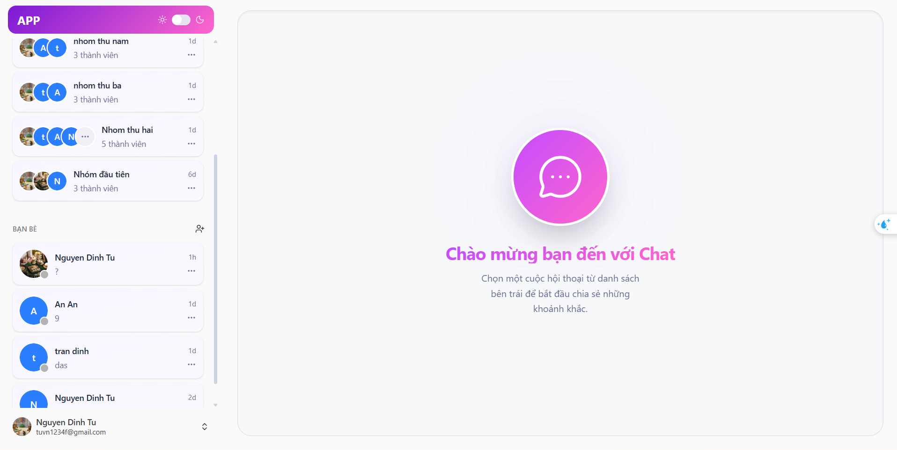
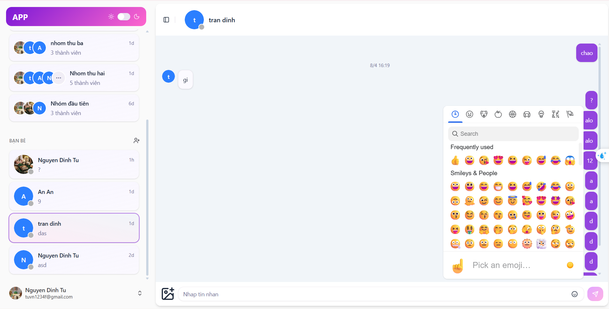
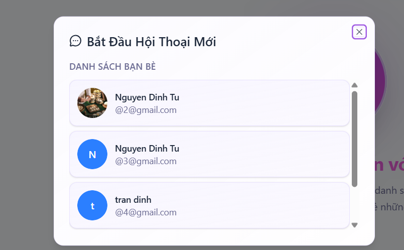
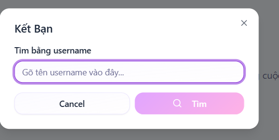

### Link: https://chatappfrontend-beta.vercel.app/

# 🚀 MERN Stack Real-time Chat Application

Một nền tảng nhắn tin thời gian thực hiện đại, hiệu năng cao, tích hợp đầy đủ các tính năng xác thực, quản lý bạn bè và truyền tải dữ liệu tức thời.


---

## ✨ Tính năng chính

- **Chat thời gian thực**: Sử dụng **Socket.io** để truyền tải tin nhắn tức thì giữa các người dùng.
- **Xác thực bảo mật**: Đăng ký/Đăng nhập với **JWT (JSON Web Tokens)** và lưu trữ an toàn qua **HttpOnly Cookies**.
- **Quản lý Media**: Tải lên hình ảnh và tệp tin mượt mà nhờ sự kết hợp giữa **Multer** và **Cloudinary**.
- **Trải nghiệm người dùng tối ưu**: 
  - Cuộn vô hạn (**Infinite Scroll**) để xem lịch sử tin nhắn mà không làm chậm ứng dụng.
  - Thông báo trạng thái (Toast notifications) bằng **Sonner**.
  - Emoji picker đầy đủ để cuộc trò chuyện thêm thú vị.
- **Quản lý State**: Sử dụng **Zustand** - giải pháp thay thế Redux gọn nhẹ và nhanh chóng.
- **Tài liệu API**: Tích hợp **Swagger UI** giúp việc kiểm thử API trở nên dễ dàng.

---

## 🛠 Công nghệ sử dụng

### Frontend
- **Framework**: React 19 (Vite 7)
- **Ngôn ngữ**: TypeScript
- **Styling**: Tailwind CSS v4, Radix UI, Lucide Icons
- **Quản lý state**: Zustand
- **Xử lý Form**: React Hook Form & Zod

### Backend
- **Runtime**: Node.js (v22.22.0)
- **Framework**: Express.js
- **Database**: MongoDB (Mongoose)
- **Real-time**: Socket.io
- **Xác thực**: Bcrypt & JWT

---

## 📁 Cấu trúc dự án

```text
backend/
├── src/
│   ├── controller/      # Xử lý logic nghiệp vụ cho từng thực thể (Auth, Message, User...)
│   ├── libs/            # Chứa cấu hình kết nối Database (db.js) và các thư viện dùng chung
│   ├── middlewares/     # Kiểm tra quyền truy cập (Auth), xử lý lỗi và upload file
│   ├── models/          # Định nghĩa cấu trúc dữ liệu MongoDB (Schemas)
│   ├── routers/         # Định nghĩa các tuyến dẫn API (Endpoints)
│   ├── socket/          # Xử lý các sự kiện thời gian thực (Socket.io logic)
│   ├── utils/           # Các hàm tiện ích (Helper functions)
│   ├── server.js        # File khởi tạo server và kết nối các thành phần chính
│   └── swagger.json     # Tài liệu API định dạng Swagger
├── .env                 # Lưu trữ biến môi trường (Database URI, Secret Keys)
└── package.json         # Quản lý dependencies và scripts chạy backend

frontend/
├── src/
│   ├── assets/          # Hình ảnh, icons và tài liệu tĩnh
│   ├── components/      # Các UI Components tái sử dụng (Button, Input, ChatBox...)
│   ├── hooks/           # Các custom React Hooks xử lý logic độc lập
│   ├── lib/             # Cấu hình các thư viện bên thứ ba (Axios instance, Utils)
│   ├── pages/           # Các trang chính của ứng dụng (Home, Login, Register)
│   ├── services/        # Nơi gọi API từ backend
│   ├── stores/          # Quản lý trạng thái toàn cục với Zustand (ChatStore, AuthStore)
│   ├── types/           # Định nghĩa các interface/type cho TypeScript
│   ├── App.tsx          # Thành phần gốc, quản lý Routing
│   ├── index.css        # Styles toàn cục (Tailwind directives)
│   └── main.tsx         # File khởi tạo ứng dụng React
├── .env.development     # Biến môi trường cho môi trường Dev
├── .env.production      # Biến môi trường cho môi trường Production (Render)
├── tailwind.config.ts   # Cấu hình giao diện Tailwind CSS
├── vite.config.ts       # Cấu hình công cụ đóng gói Vite
└── tsconfig.json        # Cấu hình nghiêm ngặt cho TypeScript
```
---

## 📁 Cài đặt và chạy thử
### 1. Yêu cầu hệ thống

- Node.js phiên bản 22 trở lên.
- Tài khoản MongoDB Atlas hoặc MongoDB chạy local.
- Tài khoản Cloudinary để lưu trữ hình ảnh.

### 2. Cài đặt backend

- cd backend
- npm install
- npm run dev

#### 🔑 Cấu hình biến môi trường (.env)
Tạo file .env tại thư mục /backend với nội dung:

- PORT=5000
- MONGO_URI=your_mongodb_connection_string
- JWT_SECRET=your_super_secret_key
- CLOUDINARY_CLOUD_NAME=your_cloud_name
- CLOUDINARY_API_KEY=your_api_key
- CLOUDINARY_API_SECRET=your_api_secret


| Biến | Mô tả | Nguồn lấy |
| :--- | :--- | :--- |
| `MONGO_URI` | Chuỗi kết nối cơ sở dữ liệu | MongoDB Atlas |
| `JWT_SECRET` | Mã bí mật để mã hóa Token | Tự tạo (Chuỗi ngẫu nhiên) |
| `CLOUDINARY_...` | Thông tin xác thực để upload ảnh | Cloudinary Dashboard |

### 3. Cài đặt Frontend

- cd ../frontend
- npm install
- npm run dev

## 📸 Demo & Screenshots












